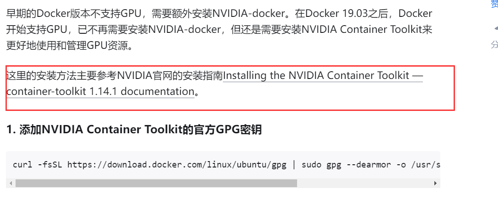
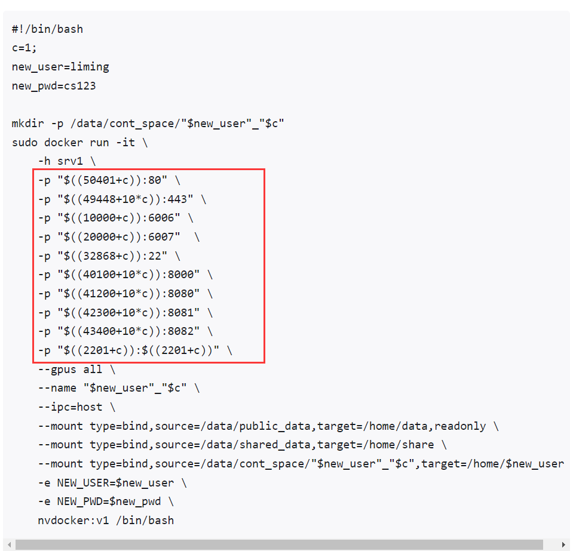
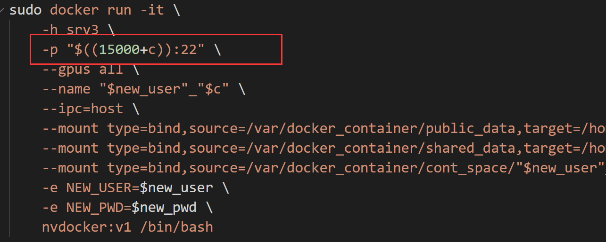
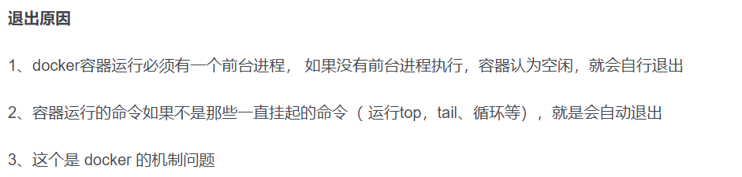
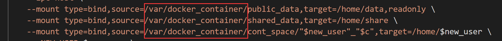
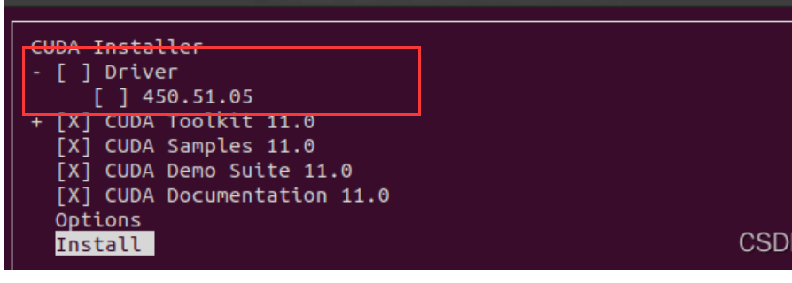
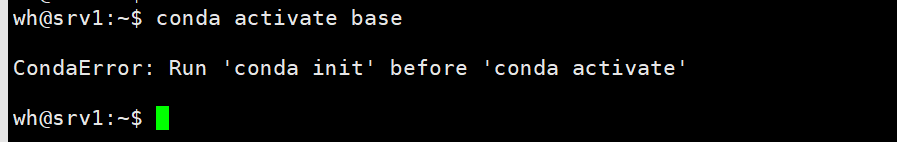
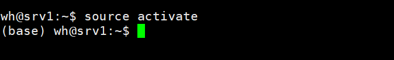

# <center>Docker使用说明</center>

## <a href="#1">1、Docker安装</a>
## <a href="#2">2、Docker常用命令</a>
## <a href="#3">3、Docker使用注意事项</a>

## 1、Docker安装<a id="1"/>
### Docker安装参见[教程](./安装教程)
##### (1) 在安装过程中，安装NVIDIA Container Toolkit 可能会报错，可以打开教程中给出的官方安装指南链接，使用其中的命令进行安装。
*******

*******

##### (2) 教程run_container.sh文件中给出了多个端口映射


##### 只需要保留22端口的映射即可
ls

##### run_container.sh -h参数表示宿主机名字，注意修改一下，不改直接用srv3也行,不会报错

##### (3) <font color=red>Docker 容器会发生自动退出，是因为没有一个可以支撑docker 持久运行下去的命令</font>
****

****
##### 解决方式：
##### &emsp;&emsp;(a):新建容器的时候，将```-it```参数换为```-idt```，其中```-d```表示后台运行
##### &emsp;&emsp;(b):已有的容器可以挂一个tmux补救一下

##### (4) Docker安装过程中需要的文件在文件夹[docker_init](./docker_init)中

##### (5) 如果docker创建的容器保存/var文件夹下，如下图所示

##### 则需要给docker_container文件夹加上777权限，否则容器内创建文件需要sudo权限


## 2、Docker常用命令<a id="2"/>
#### 查看容器
```docker ps```
#### 查看所有容器（包括已停止的容器）
```docker ps -a```
#### 查看镜像
```docker images ls```
#### 启动已停止的容器
```docker start name```
#### 停止容器
```docker stop name```
#### 删除容器
```docker rm name```
#### 进入容器
```docker attach container_id```


## 3、Docker使用注意事项<a id="3"/>
##### (1) 容器内/home文件夹下有三个文件夹，分别是data文件夹，share文件夹和xxx（用户名）文件夹，其中/home/data专门用于访问宿主机上的公开数据集，因为数据集是所有用户共用的，不必每个用户都在自己的容器内部存放一份，另外设为只读访问，只有宿主机中可以对其修改； /home/share用于用户分享自己的数据、文件到宿主机给其它用户访问。

##### (2) 容器默认安装cuda 11.4 如果需要其他版本cuda可以自行安装，安装时请务必<font color=red>取消安装驱动选项</font>，如下图所示


##### (3) 利用ssh连接容器时，conda是未激活的，直接执行`conda activate base`会提示如下错误


这时先执行一下 `source activate`就可以了



##### (4) 容器内系统时间不对，使用`date -R`查看，发现是时区错误，可通过如下方法修改
###### 1、复制宿主机上的zoneinfo文件到容器下的/user/share/目录下
`docker cp /usr/share/zoneinfo 容器名称:/usr/share/`
###### 2、进入容器当中，创建软连接，修改时区
`sudo ln -sf /usr/share/zoneinfo/Asia/Shanghai /etc/localtime`
`sudo echo "Asia/Shanghai" > /etc/timezone`
执行`sudo echo "Asia/Shanghai" > /etc/timezone`命令是，可能会出现`-bash: /etc/timezone: Permission denied`的问题，原因是`/etc`文件夹下没有timezone文件。
建议在`~`路径下，先创建`timezone`文件，并写入`Asia/Shanghai`,再将该文件移动到`/etc/`下
